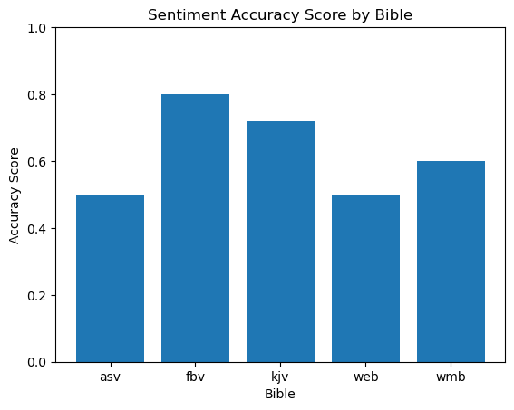
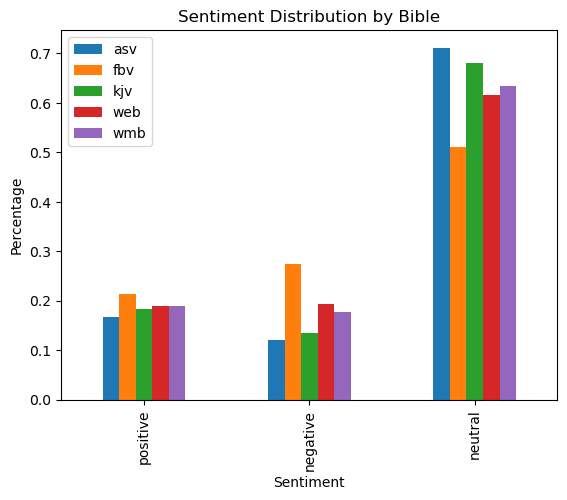
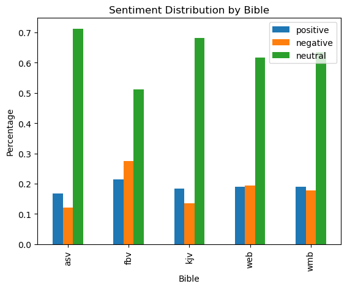

# Sentiment Analysis of Bible translations

This repo contains the source code for our analysis of 5 bible translations: American Standard Version (ASV), Free Bible Version (FBV), King James Version (KJV), World English Bible (WEB), World Messianic Bible (WMB).

### Overview
All files are generated into the folder their respective script is in.
1. Data
   1. In [api_pipeline.ipynb](data/bibles/api_pipeline.ipynb) we collect bible data from [API.Bible](https://scripture.api.bible/)
   2. In [chunk_verses.ipynb](data/bibles_chunked/chunk_verses.ipynb) we chunk the verses in groups of 3
   3. In [get_random_verses.ipynb](data/random_veres/get_random_verses.ipynb) we get random verses from each bible (not used. Chunks instesad.)
   4. In [get_random_chunks.ipynb](data/random_chunks/get_random_chunks.ipynb) we get random chunks of verses from each bible to annotate (us and the model)
2. Manual Annotation
   1. In [manual_annotation](manual_annotation/anno_instructions.md) we manually annotate the random chunks
   2. In [agreement.ipynb](annotation_analysis/agreement.ipynb) we compile labels from each annotator and calculate agreement with various metrics
3. Model Annotation
   1. In [bible.ipynb](model_annotation/bible.ipynb) we run our model on the bible data
   2. In [bible_comparison.ipynb](annotation_analysis/bible_comparison.ipynb) we compare the model's sentiment to the manual annotations (accuracy)
4. Model Accuracy
5. Translation Comparisons
6. Sentiment by Character
7. Low Frequency Token Analysis

# Setup
Note: you must have a Python environment and a way to run .ipynb files.

1. Clone the repo and cd into it
2. 
    ```
    pip install -r requirements.txt
    ```

# Data
### Collecting the data
Bible data is easy to come by, however we needed our data to be uniform across translations, which is not as easy. Our requirements led us to use https://scripture.api.bible/.

API.Bible is an api that provides access to ~2500 bible translations in a uniform format.\
To collect the data we did the following:
1. Make an API.Bible account to get a key
2. Run [api_pipeline.ipynb](data/bibles/api_pipeline.ipynb) in `data/bibles/`

Here is a brief overview of the function that does the heavy lifting. The actual code is more robust with exceptions for failed requests so only actual verses are written to the csv, this is simplified for readability.

> [data/bibles/api_pipeline.ipynb](data/bibles/api_pipeline.ipynb)
```python
def pipeline(bibleID, bibleName):

    # the most verses you can get at once is all verses of a chapter
    # so here we get the chapter IDs for each chapter in each book (excluding intros)
    # we use these IDs to request the verses for each chapter
    url = f"{baseURL}/bibles/{bibleID}/books"
    response = requests.get(url, headers=headers, params={"include-chapters": True}).json()
    chapIDs = jmespath.search("data[].chapters[?number!='intro'].id[]", response)

    # make a csv
    with open(f"{bibleName}.csv", "w") as f:
        writer = csv.DictWriter(f, fieldnames=["citation", "verse"])
        writer.writeheader()

        # get verses for each chapter
        for chapID in chapIDs:

            # request chapter info
            url = f"{baseURL}/bibles/{bibleID}/chapters/{chapID}"
            response = requests.get(url, headers=headers, params={"content-type": "text"}).json()
            print(response)

            # str of all verses in the chapter
            verses = response["data"]["content"]

            # split into individual verses
            verseList = re.split(r"\s*\[\d+\]\s*", verses.strip())
            verseList = [v.strip() for v in verseList if v]

            # write a line to the csv for each verse
            for i, verse in enumerate(verseList):
                writer.writerow({"citation": f"{response['data']['id']}.{i+1}", "verse": verse})
                print(f"wrote: {verse}")
```

### Chunking the Data
For reasons we will discuss in the following section, it was benificial to chunk the verses into groups of 3.

> [data/bibles_chunked/chunk_verses.ipynb](data/bibles_chunked/chunk_verses.ipynb)
   ```python
    def chunker(df: DataFrame) -> DataFrame:
        new_df = (
            # group by every 3 verses
            df.groupby(df.index // 3)
            # citiation: first cit. in group
            # verse: join all verses
            .agg({"citation": "first", "verse": " ".join})
            # rename cols
            .rename(columns={"citation": "start_citation", "verse": "text"})
        )
        # rename index
        new_df.index.name = "chunk"
        return new_df
   ```

# Manual Annotation

In order to evaluate our model's accuracy we need labeled data. Because we don't have access to sentiment labels for all of these bibles, we needed to do our own annotation.

Initially we were going to annotate by verse, but we learned that bible verses are quite short (many just a sentence fragment), making them challenging to annotate alone.\
Because of this we decided to annotate in chunks of 3 verses.

We chose to anotate
- 10 chunks of ASV, FBV, WEB, & WMB
- 50 chunks of KJV

We chose to do 50 of KJV instead of 10 like the others because we were particularly worried about the model's accuracy on the old style of english KJV uses. Looking back it would've been better to do 50 for all of the bibles; 10 was too few.

Getting the random chunks
---
In `data/random_chunks/`\
Get random chunks from each bible
> [data/random_chunks/get_random_chunks.ipynb](data/random_chunks/get_random_chunks.ipynb)
   ```python
    # make csv with 10 random chunks for each modern bible
    for bible in ["asv.csv", "fbv.csv", "web.csv", "wmb.csv"]:
        df = pd.read_csv(f"../bibles_chunked/{bible}")
        df.sample(10).to_csv(f"{bible}", index=False)

    # 50 chunks for the KJV
    df = pd.read_csv("../bibles_chunked/kjv.csv")
    df.sample(50).to_csv("kjv.csv", index=False)
   ```

   
Annotating the chunks
---
in `manual_annotation/`

We each added a 'sentiment' column to each random chunk, either by manually typing the numbers or using the [anno.py](manual_annotation/anno.py) script.

Each of us followed the instructions in
> [manual_annotation/anno_instructions.md](manual_annotation/anno_instructions.md)

> ## 1. Copy the random verses
> Make a copy of each csv file in `data/random_chunks` and put it in a folder named with your name like
> ```
> manual_annotation
> └── John
>     ├── asv.csv
>     ├── fbv.csv
>     ├── kjv.csv
>     ├── web.csv
>     └── wmb.csv
> ```
> 
> ## 2. Annotate
> ### Option A - Use Olivia's script
> 1. Copy `./anno.py` into your folder with your csv files.
> 2. Go to the main function and change it to your name
> 3. Run the file
> 
> ### Option B - Do it manually
> To each file, add a `sentiment` label to each row like this
> 
> ```
> chunk,start_citation,text,sentiment
> 2556,1SA.17.50,"So David prevailed...", 1
> ```
> 
> CLASSIFICATIONS\
> **1**: Neutral\
> **2**: Positive\
> **3**: Negative


Annotator agreement
---
in `annotation_analysis/`

The annotated chunks are compiled into one file [annotator_labels.csv](annotation_analysis/annotator_labels.csv) using the script [agreement.ipynb](annotation_analysis/agreement.ipynb)\
[annotator_labels.csv](annotation_analysis/annotator_labels.csv) looks like this

    bible,chunk,olivia,river,gerardo,nick,cameron
    asv,2556,3,2,1,3,3
    asv,10127,3,3,3,3,3
    asv,9900,2,2,1,2,2

Then we calculate Fleiss' Kappa and a few other numbers and plot them.
Methodology is well documented there in [agreement.ipynb](annotation_analysis/agreement.ipynb)


# Model Annotation
In `model_annotation/`

In [bible.ipynb](model_annotation/bible.ipynb) we run our model on our bible data. Moving through each chunk (row of a particular translation's csv file), we parse the model's output to grab the sentiment score with the highest relative confidence score and the confidence score itself. Since we wanted our model annotations to be in the same format as our manual annotations, we generated similar columns in our output csvs. 

Model output:
    [[{'label': 'negative', 'score': 0.8345967531204224},
    {'label': 'neutral', 'score': 0.1521468460559845},
    {'label': 'positive', 'score': 0.013256409205496311}]]

Sample annotated csv:
    chunk,start_citation,text,sentiment,confidence
    0,GEN.1.1,"In the beginning God created...",1,0.5875061750411987
    1,GEN.1.4,"And God saw the light, that it...",2,0.6193588972091675

Ultimately, this ran fine, but we did run into a few runtime errors related to the length of text being input into our classifier. Tensorflow has a maximum input tensor size, and we found that a few lines in the WEB translation were causing issues. To remedy this, we implemented a try-except clause to handle these exceptions, annotating these lines with a sentiment score of "0" to filter them out from the rest of our data. Since we only encountered this problem with <10 chunks, we considered it to have a negligable impact on our overall analysis.

All annotated translations were exported in csv format to be used by our analysis files later.

# Model Accuracy
In `annotation_analysis`

In order to test the accuracy of our model, we were interested in comparing our manually annotated data to the annotations provided by our model. This process involved generating plots to visualize sentiment distribution across translations and finding the similarity between each set of annotations for every translation. In order to discover any outlying annotation data that might be disrupting our accuracy score, we chose to use the mode as well as the average, comparing the results from both.

From this plot, which utilizes the mode of our manual annotations as a baseline, we found that our model classified the `FBV` tranlation with the highest accuracy, of around 80%:


It is important to note that we (the students) may not know how to properly assess sentiment. I could be the case that the model is more accurate than us - As we see in the kappa scores, even us students could rarely agree on the sentiment for each verse


# Translation Comparisons
In `annotation_analysis`

The overall goal of our project was to identify if there were any discrepancies in sentiment across different translations of the Bible. In order to do this, we performed a full sentiment classification for each translation, observing the distribution of neutral, positive and negative groups of text in each.

In [bible_comparison.ipynb](annotation_analysis/bible_comparison.ipynb) we simply gather the sentiment labels for each translation calculating a relative percentage of each translation that falls under each. Following this, we decided to visualize this with two different plots.

The first of these plots is interested in comparing individual sentiment scores across each translation:


The second plot is more interested in observing the distribution of sentiment within each translation:


**Overall, we found that the most neutral translation seems to be the `ASV`. The translation with the highest variance is the `FBV`, with the highest percentage of positive AND negative sentiment scores across all translations, also featuring a relatively low level of neutrality**


# Sentiment by Character
In `char_sent_analysis`

For this portion of our project, we were interested in finding whether or not different translations portray characters differently. By filtering our model-annotated data, we could isolate chunks of verses that explicitly mentioned certain characters. By examining the overal sentiment and related confidence scores for each character, we were able to identify some discrepancies across translations.

In [characters.ipynb](char_sent_analysis/characters.ipynb) we define a list of 100 characters that appear in most translations of the Bible. From here, using a helper function, `most_frequent_sentiment()`, to find the highest occuring sentiment related to mentions of a particular character, we iterate through each bible translation, gathering this information.

Once we identify the overal sentiment related to each character, we find the average confidence score across all of those mentions with the corresponding sentiment label. Results from this step are exported as `char_analysis_confidence.csv`

**Overall, we found that the `ASV` seems to portray characters with the most neutral sentiment, which coincides with our findings from the previous section**

In order to identify possible discrepancies, we identified characters that were labeled with neutral, positive AND negative sentiment in one or more translations. Out of this list, we gathered the top 10 characters based on variance within the average confidence scores for each translation. Results from this step are exported as `top10conflict_confidence.csv`

Our results indicated that **Adam** was the most volatile character when it comes to sentiment across translations, with the following results:

    name,asv sent,asv conf,fbv sent,fbv conf,web sent,web conf,wmb sent,wmb conf,kjv sent,kjv conf
    Adam,Neutral (1),0.76,Negative (3),0.74,Positive (2),0.81,Negative (3),0.59,Neutral (1),0.74


# Low Frequency Token Analysis
We made a Low Frequency Token Analysis so as to assess our model's accuracy given the occurance of unusual tokens. Given that we could not obtain the tokens our model was trained on, we obtained the 200 least frequent words in each bible translation and compared the average confidence and sentiment averages with and without the bible verses that include these words. We included plots to visualise our results using matplotlib. We also included a csv that contains all the resulting metrics from this analysis, which are located in `Low_Freq_analysis/least_frequent_results.csv`. The metrics we used to assess our model's accuracy were neutral, postive, and negative averages, along with the average confidence. We used pandas for data manipulation and to remove the rows with the lowest frequency tokens. We found that there was no significant difference between the accuracy of the model with the least frequent tokens and without them.

The Low Frequency token Analysis is located in `low_freq.ipynb`. Make sure to download full `Low_Freq_analysis` folder and install all dependencies.

# Contributions

**Project maintenence**

- Collect the data
  - Olivia
  - Cameron
- Coordinate and analyze manual annotations
  - Olivia
- Run the model on the bibles
  - Nick
- Compare model to manual annotations (accuracy)
  - Cameron
  - Gerardo
- Compare sentiment between characters
  - Nick
- Low frequency token analysis
  - Gerardo
  - River
- Lead making the slides
  - Everyone
- Lead writing the README
  - Olivia
  - Nick
- Organize the repo/drive/requirements for deliverables
  - Olivia

<br>

**File authors**
- [original api pipeline](data/bibles/old_api_pipeline/pipeline.ipynb) - Cameron
- [api_pipeline.ipynb](data/bibles/api_pipeline.ipynb) - Olivia
- [get_random_verses.ipynb](data/random_verses/get_random_verses.ipynb) - Cameron
- [get_random_chunks.ipynb](data/random_chunks/get_random_chunks.ipynb) - Olivia
- [anno_instructions.md](manual_annotation/anno_instructions.md) - Olivia
- [anno.py](manual_annotation/anno.py) - Olivia
- [agreement.ipynb](annotation_analysis/agreement.ipynb) - Olivia
- [bible.ipynb](model_annotation/bible.ipynb) - Nick
- [bible_comparison.ipynb](annotation_analysis/bible_comparison.ipynb)
- [positive_negative_analysis.ipynb](annotation_analysis/positive_negative_analysis.ipynb)
- [characters.ipynb](data/character_chunks/characters.ipynb) - Nick
- [Low_freq.ipynb](Low_Freq_analysis/Low_freq.ipynb) - Gerardo
